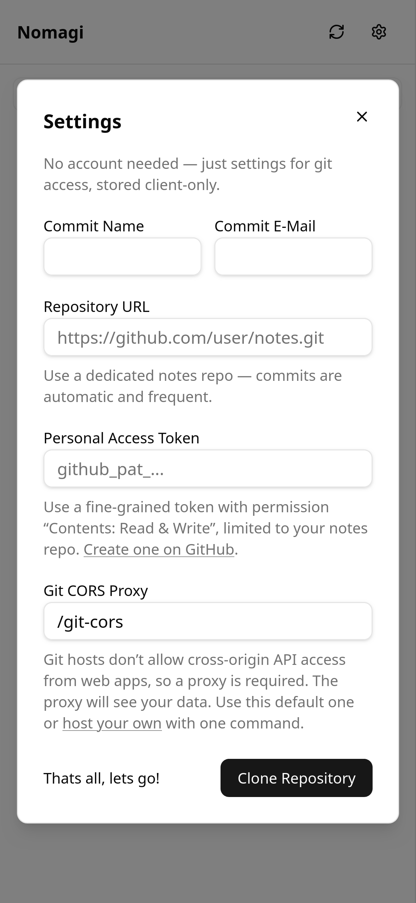
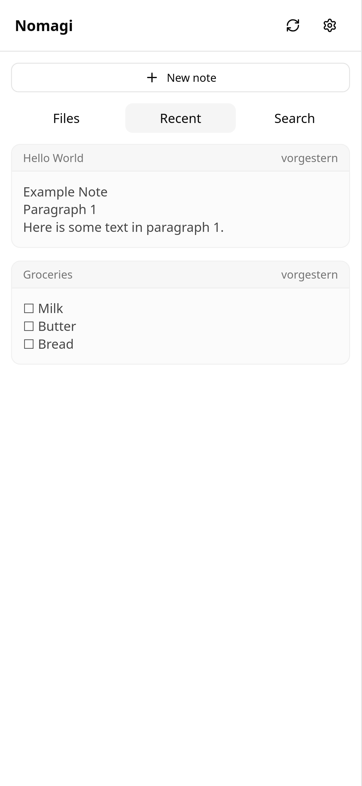
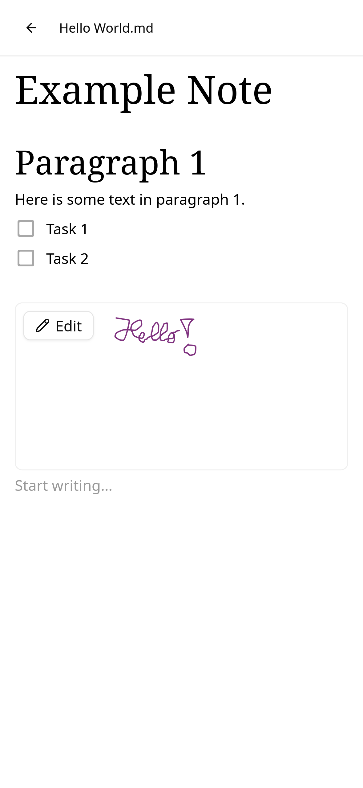

# Nomagi — modern notes app using markdown and git

Technically a pure frontend to **plain Markdown files in your own Git repo** — but acts like a **modern notes app** with mobile and offline support plus advanced features like **handwritten sketches**.

Web-app, installable as a PWA for a native-like, offline experience on mobile (iOS/Android) and desktop.

Client-only, no need to host anything (beside an optional small CORS proxy for maximum privacy).

Works with any git hoster that supports personal access tokens (GitHub, GitLab, gitea).

| Setup | Recent | Example note |
| --- | --- | --- |
|  |  |  |

## Who it's for

People who value Markdown and Git as a **safe, durable home for valuable personal or work notes** but don't want to miss out on features that a code editor can't provide - like taking handwritten notes on a tablet.

Not for users who need real-time collaboration or project management features (like tasks, databases and kanban boards); consider tools like NextCloud Whiteboard (Excalidraw) or AFFiNE instead.

## Why this app

- **Plain Markdown, even on disk.** Notes are stored as standard `.md` files, not a proprietary or "markdown-like" internal format. No vendor lock-in, you can switch to other tools at any time and edit files manually with external editors.
- **Modern WYSIWYG editing.** A polished [Milkdown](https://milkdown.dev/) editor, not a raw textarea. Notion-like convenience.
- **Sketches where you need them.** Handwriting and sketch blocks live *inside* a Markdown note as SVG, kept simple and local to the document. Works great on a tablet / iPad.
- **AI outsourced** Because notes are plain files, point *any* agent (Cursor, Copilot, Claude, …) directly at your repo to edit, refactor, or summarize. No need for the app to ship its own slightly-worse, less-maintained AI features — best-in-class tools work on your files directly.
- **Nothing to host, you still own the data** The app is **client-only** — nothing to host (except optionally a CORS proxy, see below). Point it at any Git remote you already trust (GitHub, self-hosted GitLab, a local bare repo). No additional maintenance, no "the app server shuts down after a year" risk.
- **Git does the hard parts, invisibly.** Versioning, history, backup, and conflict resolution are handled by Git — but you never see it. No commits, no push/pull, no merge prompts. It auto-saves and syncs in the background, so it just feels like any modern app that saves for you.
- **Truly open.** Fully open-source free software — not just "source available." You can fork it and keep it alive.

## How it compares

| | Nomagi | Notion / cloud apps | Obsidian / Logseq | Joplin | Markdown + Git by hand |
|---|---|---|---|---|---|
| Storage format | Plain Markdown | Proprietary cloud DB | Plain Markdown | Markdown-*like* internal format | Plain Markdown |
| Self-host / server needed | None (client-only) | Hosted by vendor | None (local files) | Optional sync server | None |
| Sync & conflict resolution | Git, automatic & invisible | Vendor cloud | Manual / paid sync | Custom sync | Manual (you run Git) |
| Offline-first mobile PWA | Yes | Varies | Varies | Yes | No |
| Edit notes with any AI agent | Yes (plain files) | Limited / built-in only | Yes | Indirect | Yes |
| Polished WYSIWYG editor | Yes (Milkdown) | Yes | Partial | Partial | No |
| Handwritten / sketch notes | Yes (blocks in a note) | No | Via plugins | Via plugin | No |

## Roadmap

Currently, sketches are scoped to blocks *within* a note, not a free-floating canvas across documents or anywhere on documents (like with OneNote).

A whiteboard/canvas may come later via Obsidian's open [`jsoncanvas`](https://jsoncanvas.org/) format — so even future features stay in portable, open formats.

## Try it

A public test instance is available at [notes.luminosus.org](https://notes.luminosus.org). Use it to try the app without hosting anything yourself. It is **not** intended for production or long-term use — the server may be **shut down at any time**. For anything you care about, self-host or find a public instance. The included CORS proxy can see your notes during transit for technical reasons, see below. This means you have to trust it in the same way you might trust the git provider or any other cloud backend like Notion. Your data is never stored on the test server, only in git.

## Fully private notes (local Gitea)

You can keep notes **entirely on your device** while still using a public Nomagi instance (e.g. [notes.luminosus.org](https://notes.luminosus.org)) or someone else’s hosted app. Nomagi is only static files in the browser; sync talks **directly** from your browser to Gitea on your machine. Notes, tokens, and git traffic **never** go through the Nomagi server, and **no CORS proxy is used or needed**.

1. Run Gitea locally — see [`local_gitea_instance/`](local_gitea_instance/) for a ready-made Docker Compose setup with browser CORS already configured.
2. Set up Gitea:
   - Open **http://localhost:55001**
   - Complete the install wizard — create your admin account
   - **+ → New Repository** — name it `notes` (or whatever you prefer); don’t initialize with a README
   - **Settings → Applications → Generate New Token** — scope: `write:repository`
3. In Nomagi **Settings**:
   - **Repository URL:** `http://localhost:55001/USER/notes.git` (replace `USER` and repo name; use your port if different). Do **not** embed username or token in the URL.
   - **Personal Access Token:** your Gitea token.
   - **Git CORS Proxy:** leave **empty**.

Gitea must allow CORS from the origin where you open Nomagi (e.g. `https://notes.luminosus.org`). The example in `local_gitea_instance/` sets this in `.env`. CORS checks the **Nomagi page origin**, not your location — so the same direct-browser-to-Gitea flow works from any device, as long as Gitea allows that origin.

### Your own Gitea on the internet

The same setup extends to a Gitea instance you expose on the internet. Use your public clone URL in **Repository URL** (e.g. `https://gitea.example.com/USER/notes.git`), leave **Git CORS Proxy** empty, and configure CORS as in [`local_gitea_instance/`](local_gitea_instance/). The browser still talks directly to Gitea — no proxy. Hardening the server (HTTPS, access control, updates, etc.) is up to you.

## Self-hosting

The production image is a single **nginx** container: it serves the built app and a same-origin **CORS proxy** at `/git-cors/` that forwards to any Git HTTP or HTTPS host (GitHub, GitLab, Gitea, self-hosted, …).

```bash
cp .env.example .env   # optional: set PROD_PORT (default 55112)
docker compose up -d --build
```

Put the container behind your own TLS terminator / reverse proxy (nginx, Caddy, Traefik, …) to enable HTTPS if you expose it on the internet.

### Why does it require a CORS Proxy?

If there was no need for a CORS proxy, we could just host the static files for everyone and nobody would see the data except for the git provider.

But we had two goals with Nomagi:
1. **Using an existing git repo** to store the data: a) to make the notes available to other tools, and b) to remove the need for a custom storage and syncing backend.
2. **And not having to maintain client apps.**

This is why we chose an installable Progressive Web App (PWA) with direct git interaction. But this combination - using git from a browser - always requires a CORS proxy (if you use typical providers like GitHub or GitLab).

### Why does the CORS proxy see the data?

Any CORS proxy **sees your note content**, git URL and personal access token. This data is in the same part of the HTTP request as the headers it needs to modify, so it has to have unencrypted access to it.

If you trust the provider of the CORS proxy or don't handle sensitive data, you can use a public instance.

Self-host the app files and CORS proxy on the same origin to fully protect your data, see self-hosting section above.

### Rejected alternative approaches

- **Client apps**: Securly providing client apps (through apps stores and as signed installers) requires constant maintenance and developer account costs. While this might work for a short time, it is a risk for the long term availability of the app.
- **End-to-end encryption**: Providers like GitHub do not support transparent end-to-end encryption of the data. They only support encrypting the transport layer for direct connections (Git smart HTTP, git over SSH, custom REST API). Additionally, E2E encryption requires secure transfer of the key to all used devices, which is difficult in practice (storing it in a backend would eliminate the purpose).
- **git over SSH**: Browser don't allow TCP connection on arbitrary ports like port 22.
- **Provider specific REST API**: GitHub and others offer a REST API that might allow to create commits. But this would limit the app to specific providers and might not support all features of git like conflict resolution.
- **Self-host a custom backend like other open source note apps**: Custom backends can become outdated and a security risk easily. Nomagi only requires an agnostic CORS proxy + static file hosting + usually existing git hoster.
- **Public cloud backend like Notion**: When using tools like Notion, the data is typically encrypted during transit and also at rest, but to simplify the usage, the providers hold the encryption keys. So they can decrypt the data at any time, and the data is usually also unencrypted between the termination of the HTTPS transfer and the encryption on disk (same as with the CORS proxy between receiving the request and forwarding it to e.g. GitHub).
- **Using local files like Obsidian**: Leaves the complex part of syncing the files to the user. Solutions like NextCloud can be more brittle with conflicting updates than git.

Git hosts do not allow browser apps to call their Git HTTP API cross-origin. [isomorphic-git](https://isomorphic-git.org/) needs that API to clone, fetch, and push. A small reverse proxy on the **same origin** as the app forwards those requests so the browser allows them.

## Development

```bash
npm install
npm run dev
```

Vite serves the app with hot reload (default http://localhost:5173). The dev server includes the same `/git-cors/` proxy as production.

## Auto-save & sync

The app automatically saves changes by creating commits (it amends to the last commit within a reasonable time), and sync the notes to the git remote using pull & push. It resolves conflicts by always taking both changes.

| When | Commit (local) | Sync (remote) |
| --- | --- | --- |
| Editing stops (~500 ms) | Yes | — |
| Switch note / mobile back | Yes (pending edits) | If edited or unpushed |
| Tab hidden | Yes (pending edits) | — |
| App open / back online | — | Yes (skipped within 2 s of last edit) |
| Sync button | Flushes pending edits | Always (when online) |

Rapid edits within 60 s amend the same local commit until it is pushed. Sync pushes first; pull + merge only if the remote moved.

## Tech stack

Vue 3 + TypeScript + Vite, [isomorphic-git](https://isomorphic-git.org/) with LightningFS for in-browser Git, [Milkdown](https://milkdown.dev/) for editing, and `vite-plugin-pwa` for offline/installable support.

## Naming

**Nomagi** combines **no** (notes), **ma** (markdown), and **gi** (git). It also hints at “no magic”: plain Markdown and Git, with no custom format or backend.
